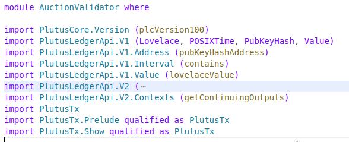

This is Plutus smart contract module code written in Haskell, designed for the Cardano blockchain. The name of the module is `AuctionValidator`. This will explain in detail declarations and import statements.



#### 1. **Module Declaration**

```haskell
module AuctionValidator where
```
- This line declares a module named `AuctionValidator`. A module is a way to group related functions, types, and other definitions. In this case, the module will contain the code related to the auction smart contract.

#### 2. **Import Statements**

- The code imports various libraries from the **Plutus Ledger API** and **PlutusTx** packages, which are essential for interacting with the Cardano blockchain.

##### Key Imports

1. **`PlutusCore.Version (plcVersion100)`**: 
   - Imports a specific version (`plcVersion100`) of the Plutus Core language, which is the lower-level language used to define smart contracts on Cardano.

2. **`PlutusLedgerApi.V1`**:
   - **`Lovelace`**: A type representing the smallest unit of ADA (the currency of Cardano).
   - **`POSIXTime`**: Represents time in a format that is compatible with blockchain transactions.
   - **`PubKeyHash`**: A type representing the hash of a public key, typically used to identify the owner of an address.
   - **`Value`**: Represents the value of a transaction, which could include ADA or other tokens.

3. **`PlutusLedgerApi.V1.Address (pubKeyHashAddress)`**:
   - Defines functionality to generate an address from a public key hash (`PubKeyHash`). In an auction, this could be used to associate the auction with a specific address or bidder.

4. **`PlutusLedgerApi.V1.Interval (contains)`**:
   - Provides utilities to work with intervals of time or other ranges. The `contains` function checks if a certain time or value is within a specified range (useful for ensuring the auction only happens within certain time limits).

5. **`PlutusLedgerApi.V1.Value (lovelaceValue)`**:
   - Helps construct values representing ADA. In the context of the auction, it would be used to define the amount of ADA being bid or transferred.

6. **`PlutusLedgerApi.V2`**:
   - This version of the Plutus Ledger API includes updated types and functions:
     - **`Datum`, `OutputDatum`**: Data attached to a UTXO (unspent transaction output) in Cardano, which can be used to store auction-related information (e.g., bid details).
     - **`ScriptContext`, `TxInfo`, `TxOut`**: Types that hold information about the transaction context, such as inputs, outputs, and UTXOs involved in the transaction. These are crucial for validating a smart contract.
     - **`from`, `to`**: Used for converting between different types, possibly related to value and time manipulations.

7. **`PlutusLedgerApi.V2.Contexts (getContinuingOutputs)`**:
   - This function retrieves outputs that are "continuing," meaning they persist after a transaction. In an auction, it could be used to check whether a UTXO (representing a bid or auction state) continues to exist.

8. **`PlutusTx` and `PlutusTx.Prelude`**:
   - The `PlutusTx.Prelude` module provides basic functions and types specialized for Plutus smart contracts, replacing the standard Haskell prelude with blockchain-appropriate tools.
   - **`PlutusTx.Show`**: This module provides functionality to convert values to strings, useful for debugging or displaying data within the smart contract.

#### 3 Key Concepts and Uses

- **Lovelace**: Represents ADA in its smallest denomination.
- **PubKeyHash**: The identity of bidders in the auction.
- **POSIXTime**: Used to determine auction start and end times.
- **Datum**: Carries auction-related data, such as current bids, auctioneer, etc.
- **ScriptContext**: Contains all the transaction data necessary for validating actions like placing a bid or finalizing the auction.

#### 4 How this Relates to an Auction
In an auction, this code is setting up the necessary imports to manage:
- **Auction Bids**: Using `Lovelace`, `Value`, and `PubKeyHash` to represent bids and bidders.
- **Time Management**: Using `POSIXTime` and `Interval` to ensure bids are placed within the auction timeframe.
- **Smart Contract Logic**: Through `ScriptContext` and `TxInfo`, the code will validate transactions (e.g., checking if a bid is higher than the current one, or if the auction end time has passed).

This section frequently uses the same modules but being familiar with their purpose is important.